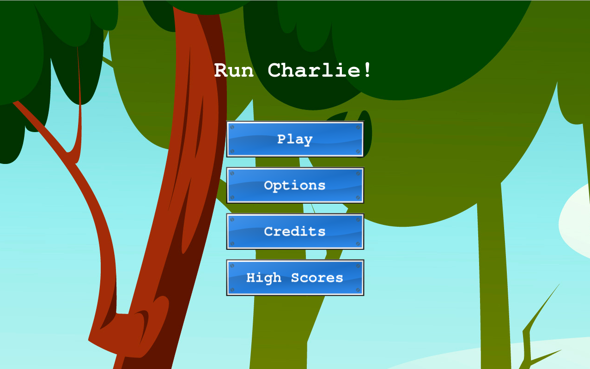
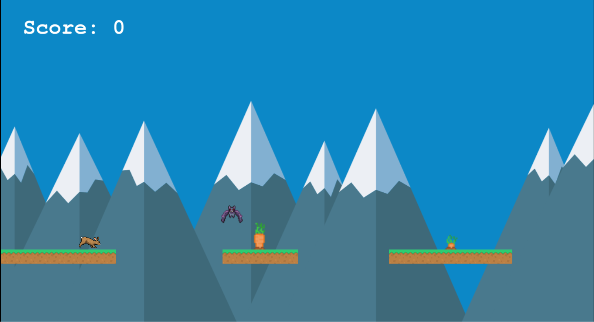

# Run Charlie

An endless runner game built in JavaScript with the Phaser Library, bundled with Webpack and transpilied with Babel.

## Run Charlie screenshot

### Main Menu

### In Game

#### [Game Design Document](./GDD.md)

## Instructions

- Play with the Mouse Click:

- MOUSE KEY/TOUCH PAD CLICK TO JUMP

- Press multiple times (maximum 3) to make a triple jump.

- Jumps exhaust when 3 jumps are done and you haven't touched the platform

- On touching the platform, the jumps are replenished.

## Built With

- HTML
- JAVASCRIPT
- PHASER 3
- NPM
- WEBPACK
- Babel
- JEST

## Getting Started

<!-- Get Api Key

- Go to openweathermap
- Select free Api key
- Create an account if you dont have one
- Copy your new Api Key
- Go to src/logic.js
- Create a new file with the name `key.js`
- Paste the following code & replace `YOUR KEY` text with your api key
  `const key = 'YOUR KEY'; export default key;` -->

To set up a local copy of the project

- `git clone git@github.com:akshay-narkar/Run-Charlie.git`
- `cd Run-Charlie`
- `git pull origin gamelogic`

If you want to repack the file

- Run `npm install` on the terminal to install dependancies
- Run `npm run build` to bundle the files in the src folder & product ouput in dist folder
- Run `npm run start` to check live server

## Live Link of the project

<!-- [Live-Weather-App](https://openweatherappmicro.netlify.app/) -->

## Author

👤 **Akshay Narkar**

- Github: [@akshay-narkar](https://github.com/akshay-narkar)
- Twitter: [Akshay](https://www.twitter.com/akidoit)
- Linkedin: [Akshay Narkar](https://www.linkedin.com/in/akshaynarkar25/)

## 🤝 Contributing

Contributions, issues, and feature requests are welcome!

## Show your support

Give a ⭐️ if you like this project!

## Acknowledgments

- [Open Game Art](http://opengameart.org/)
- [upklyak](https://www.freepik.com/free-photos-vectors/leaf)

## 📝 License

This project is [MIT](LICENSE) licensed.
